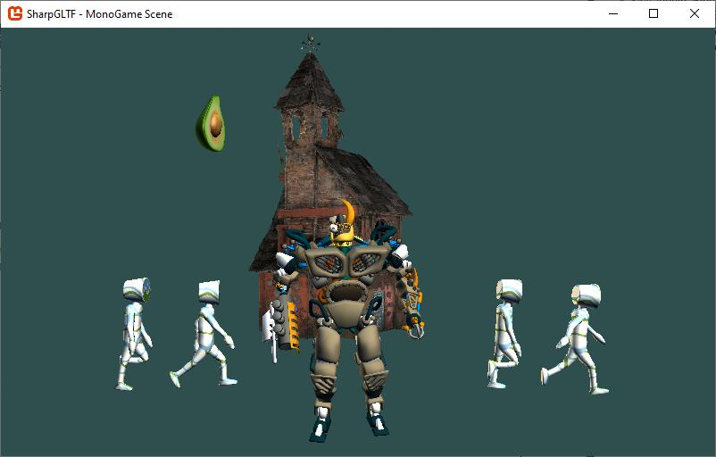

# MonoGame realtime rendering demo

### Overview

This is an example of loading and rendering glTF files with MonoGame.

This demo is just a stripped down copy of the original example code [which can be found here](https://github.com/vpenades/SharpGLTF/tree/master/examples/MonoGameScene). I've created this repository to showcase the minimum requirements to make this example work.

Although we're using this library in production code in our internal projects, this is a library made out of neccesity, due to the lack of proper glTF support in MonoGame.

The primary objectives of this demo is to showcase that MonoGame is indeed able to handle glTF files, and to provide a temporary solution for those that need some glTF support right now. But our hope is that over time, MonoGame will be able to handle glTF files on its own, so this library will no longer be needed.

### Running the demo:

The project depends on [SharpGLTF.Runtime.MonoGame](src/SharpGLTF.Runtime.MonoGame), which also depends on [SharpGLTF.Core](https://www.nuget.org/packages/SharpGLTF.Core), that's everything you need to load and render glTF models into MonoGame.

Currently, the demo is using `MonoGame.Framework.DesktopGL` Version 3.7.1.189 , if you need a different monogame backend/version, you need to download this demo, and manually replace all MonoGame.Framework references with the framework you need.

This example has been tested with `MonoGame.Framework.DesktopGL` and `MonoGame.Framework.WindowsDX`.

### Demo limitations

MonoGame typically preprocesses all graphics resources through its content pipeline, and all assets are converted to XNB files, which is what the runtime is able to load.

This is not the case of this demo; the glTF files are loaded at runtime without any preprocessing.

The reason to bypass monogame's content pipeline is to allow some glTF features that are simply not possible to be processed by the content pipeline in its current state, but as a consequence of loading glTFs at runtime, there's some other limitations:

In order to keep this example as simple as possible I avoided using custom shaders, the library uses monogame's default BasicEffect and SkinnedEffect objects, which means:
- PBR materials are not supported, and are converted/downgraded to basic materials.
- Morphing is not supported.
- Skinned meshes with more than 72 bones will probably fail.

Also, textures are loaded at runtime with no preprocessing, so:
- They might lack mipmapping
- They might not load at all if they exceed monogame's runtime limits.

Loading at runtime requires using SharpGLTF.Core, which does heavy use of advanced c# features, it is currently aimed for Monogame on Desktop and probably Android, But any project requiring BRUTE, will not be able to use this project.

