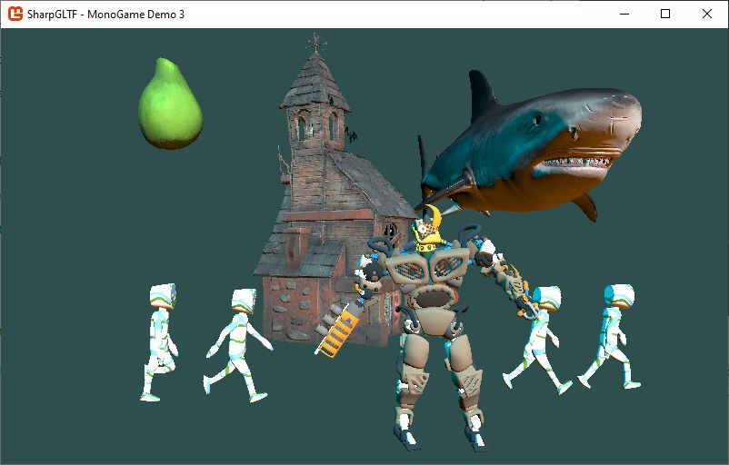

# MonoScene Framework
#### A MonoGame 3D Model alternative.

### ⚠️ Temporary pre-requirements ⚠️

This project requires compiling complex effect shaders with +256 techniques.

Current version of MonoGame, 3.8.0.1641, is not able to do that and will fail to compile.

The issue has been recently resolved and it's available in MonoGame's development branch.

MonoGame's minimum version required is: __3.8.1.1825-develop__

### Overview

MonoScene is a framework that replaces the very outdated 3D model architecture
currently available in MonoGame, providing a number of much needed features:

- PBR effect shaders.
- Full skeleton animation.
- Loading asset models at runtime.

### Architecture:

By design, the data flow of the framework looks like this:

__3D Assets ⇒ Pipeline ⇒ Content ⇒ Runtime__

The project is split into 3 sections:

- Pipeline: utilities and classes to help importing 3D asset files.
- Content: classes used to define an intermediate representation of 3D model.
- Runtime: framework to consume and render 3D content objects.

### Limitations

##### MonoGame's Content Pipeline

Right now, It is **not possible** to load glTFs through Monogame's old content processing pipeline;
glTFs need to be loaded at runtime, so only projects able to consume `MonoScene.Pipeline.GLTF` library
will be able to load glTFs.
##### Animations

- Due to limitations in the rendering API of MonoGame, glTF's morphing features are not supported.
- Maximum number of bones is limited to 72 bones with SkinnedEffect (as usual) and 128 bones with PBR effects.

##### Textures

Textures are loaded using Monogame's Texture2D.FromStream, which means all of its limitations apply:
- No Mipmaps
- glTF texture formats WEBP and Universal Basis KTX2 can't be loaded.

#### Credits

- [MonoGame](https://github.com/MonoGame/MonoGame)
- [PBR Shaders from Khronos Viewer](https://github.com/KhronosGroup/glTF-Sample-Viewer)
- [SharpGLTF library](https://github.com/vpenades/SharpGLTF)
